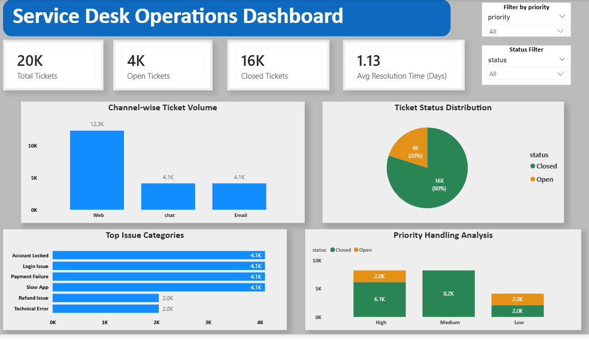

# 📌 Service Desk Operations Analytics Dashboard

This project is a **Service Desk Operations Dashboard** built using SQL and Power BI to analyze ticketing system data and generate insights on support efficiency, workload distribution, and SLA performance.

---

## 🎯 Objective

To analyze service desk operations and identify:
- Ticket resolution efficiency  
- Support channel performance  
- Priority-based workload distribution  
- SLA risk areas  

---

## 🛠️ Tools Used

- SQL (PostgreSQL)  
- Power BI  
- DAX  

---

## 📊 Key Features

- 20K+ ticket analysis  
- Open vs Closed tracking  
- Channel-wise breakdown (Web, Chat, Email)  
- Priority-based analysis  
- Issue category distribution  
- Average resolution time  

---

## 📈 Key KPIs

- Total Tickets  
- Resolution Rate  
- Open vs Closed Ratio  
- High Priority Tickets  
- Channel Contribution (%)  

---

## 📊 Dashboard Preview

---

## 💡 Key Insights

- Around 80% of tickets are resolved  
- Web channel generates highest ticket volume  
- Some high-priority tickets remain open (SLA risk)  
- Uneven workload distribution across channels  

---

## 🚀 Conclusion

This project helps understand service desk performance and identify areas to improve resolution efficiency and SLA compliance.
